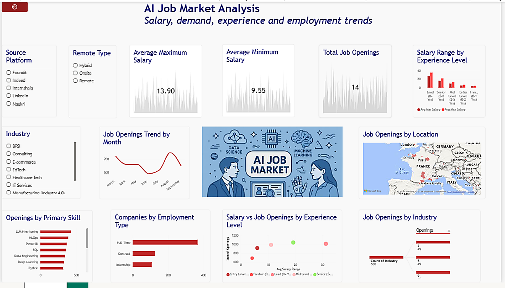

# AI Job Market Analysis Dashboard

## 📊 Project Overview

The **AI Job Market Analysis Dashboard** is an interactive Power BI dashboard designed to analyze trends in the AI job market.

The dashboard provides insights into **salary, job demand, experience levels, employment types, skills, industries, locations, and monthly job openings**.

## 🎯 Objectives

- Analyze AI job market trends
- Compare average minimum and maximum salaries
- Identify job openings by experience level
- Analyze demand for different skills
- Understand employment types such as Full-time, Contract, and Internship
- Analyze job openings across industries and locations
- Track monthly job opening trends
- Understand the relationship between salary and job openings

## 📌 Key Dashboard Features

### KPI Cards
- Average Maximum Salary
- Average Minimum Salary
- Total Job Openings

### Visualizations
- Salary Range by Experience Level
- Job Openings Trend by Month
- Job Openings by Location
- Openings by Primary Skill
- Companies by Employment Type
- Salary vs Job Openings by Experience Level
- Job Openings by Industry

### Interactive Filters
- Source Platform
- Remote Type
- Industry

## 🛠️ Tools & Technologies

- **Power BI**
- **Power Query**
- **DAX**
- **Data Cleaning & Transformation**
- **Data Visualization**

## 📈 Key Insights

The dashboard helps identify:

- Salary differences across experience levels
- Skills with higher job demand
- Employment type distribution
- Industries with AI-related job opportunities
- Locations with higher numbers of job openings
- Monthly changes in job demand
- Relationship between salary ranges and job openings

## 🖼️ Dashboard Preview

## 🚀 Project Outcome

This project demonstrates my ability to transform raw job-market data into an interactive and easy-to-understand **business intelligence dashboard using Power BI**.

It also helped me strengthen my skills in **data cleaning, data analysis, DAX, visualization, and extracting actionable insights from data**.
